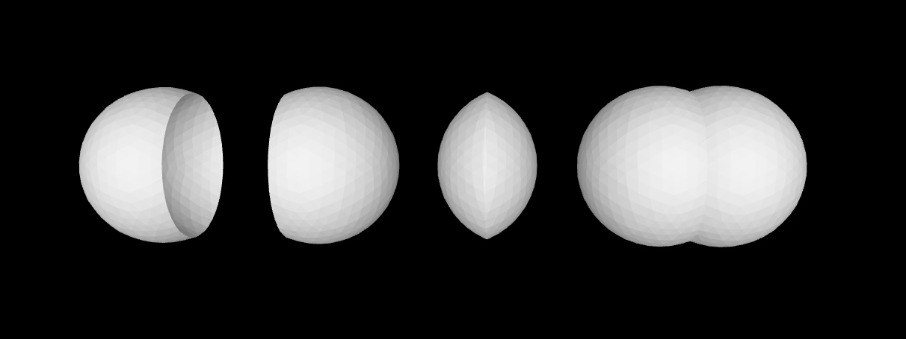

# Erratri

Erratri is a small geometry project that builds 3D shapes on the integer grid (Z^3) and exports binary STL. The demo renders a simple solar system with a sun, eight planets, their moons, and thin tilted orbit rings.

## Pure Z^3, Mesh-First

- All vertices live on the integer lattice Z^3 (no persistent floats).
- Shapes expose closed-surface meshes; many are built internally via tetra decompositions.
- Construction uses double math only transiently (e.g., rotations), then rounds back to the grid.
- Integer-only topology; rounding returns to Z^3 after transient double math.
- Higher-level shapes (sphere, cylinder shell, etc.) may decompose to tetrahedra internally.


## Demo Code

The demo uses a tiny data helper (`Demo/Planets.cs`) so `Program.cs` reads like a short scene description. Here is the essence of the program:

```csharp
using World;
using Geometry;
using Demo; // Planets helper (data only)

var world = new World();
var sunCenter = new Point(0, 0, 0);
world.Add(new Sphere(radius: 180, center: sunCenter));

void AddPlanet(in Planets.Planet p, double phaseDeg)
{
    // Thin tilted orbit ring
    world.Add(new Cylinder(radius: p.OrbitRadius, thickness: 2, height: 2,
                                   center: sunCenter, segments: null,
                                   xTiltDeg: p.InclinationDeg, yTiltDeg: 0, zSpinDeg: p.AscendingNodeDeg));

    // Place the planet on its tilted plane (details in Program.cs)
    // ... compute position and add spheres for planet and moons ...
}

// Mercury, Venus, Earth(+moon), Mars(+2), Jupiter(+4), Saturn(+3), Uranus(+2), Neptune(+1)
AddPlanet(Planets.Mercury, phaseDeg: 10);
AddPlanet(Planets.Venus, phaseDeg: 60);
AddPlanet(Planets.Earth, phaseDeg: 130);
AddPlanet(Planets.Mars, phaseDeg: 210);
AddPlanet(Planets.Jupiter, phaseDeg: 280);
AddPlanet(Planets.Saturn, phaseDeg: 330);
AddPlanet(Planets.Uranus, phaseDeg: 45);
AddPlanet(Planets.Neptune, phaseDeg: 95);

world.Save("clean_system.stl");
```

See the full, runnable code in:
- `Demo/Program.cs`
- `Demo/Planets.cs`

## Boolean Kernel Layers (Work in Progress)

The boolean mesher lives in `Kernel` and is deliberately layered:

- **Intersection graph + topology**: `IntersectionSet`, `IntersectionGraph`, `Intersection.Index.IntersectionIndex`, and `MeshA` / `MeshB` capture where two closed meshes intersect and how triangles are connected.
- **Per-triangle PSLG subdivision**: `TriangleSubdivision` and `PslgBuilder` build a local planar straight-line graph in barycentric UV space for each intersected triangle, then triangulate interior faces back to 3D.
- **Patch classification and selection**: `Patching`, `Classification`, and `BooleanClassification` group subdivided triangles into patches, classify them as inside/outside the other solid, and pick which patches to keep for each boolean operation.
- **Assembly and validation**: `BooleanMeshAssembler` merges vertices, assembles triangles into a `BooleanMesh`, and runs strict manifold and degeneracy checks. `BooleanOps` is a small façade that ties these layers together for `ClosedSurface` inputs.

The boolean gallery in `Demo.Boolean.Mesh/Program.cs` showcases four basic CSG operations on two spheres:

```csharp
using World;
using Geometry;

long r = 200;
var aCenter = new Point(0, 0, 0);
var bCenter = new Point(150, 0, 0);

var a = new Sphere(r, subdivisions: 3, center: aCenter);
var b = new Sphere(r, subdivisions: 3, center: bCenter);

var spacing = 500;
var union        = new Union(a, b).Position(0,          0, 0);
var intersection = new Intersection(a, b).Position(spacing,     0, 0);
var diffAB       = new DifferenceAB(a, b).Position(2 * spacing, 0, 0);
var diffBA       = new DifferenceBA(a, b).Position(3 * spacing / 2, 0, 0);

var world = new World.World();
world.Add(union);
world.Add(intersection);
world.Add(diffAB);
world.Add(diffBA);

world.Save("spheres_boolean_showcase.stl");
```

This produces the boolean gallery rendered in `boolean_mesh.png`.



All of this is still work in progress: the fast-path classifiers and PSLG triangulation are being iterated, and there are known regression tests (e.g., drilled boxes and "cheese" shapes) that currently fail until the kernel is tightened. The intent is to keep the layering clear and testable while gradually hardening the algorithms.

## ConstrainedTriangulator — 2D constrained triangulation library

ConstrainedTriangulator is a super simple 2D constrained triangulation library for planar straight-line graphs (PSLG). The input is a set of points together with optional constrained segments, and the output is a set of triangles that forms a complete triangulation of the domain while respecting all constraints.

The library currently implements two algorithms that share the same legality rules: a slow exhaustive sweep over all edges and vertices, and a less slow adjacency-driven pass with a single global completion sweep. Both ensure that constrained segments are always honored, new edges do not cross existing segments, triangles containing interior points are rejected, and zero-area triangles are discarded. For each candidate edge, both sides are tested so that no admissible triangle is missed.

Correctness is verified by `Validator.ValidateFullTriangulation`, which runs combinatorial checks (edge manifoldness, constraint usage) together with an Euler face count (outer boundary plus holes) to ensure that the result is a complete triangulation of the input PSLG. 


## Building and Running

- Build: `dotnet build Erratri.sln -c Release`
- Run demo: `dotnet run --project Demo -c Release`
- Output: `Demo/bin/Release/net9.0/clean_system.stl`
