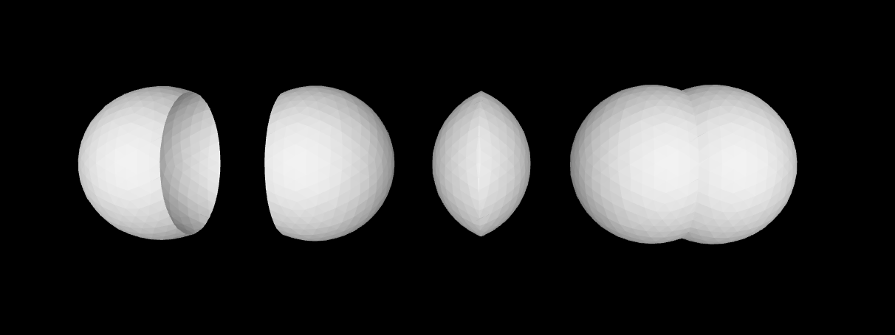
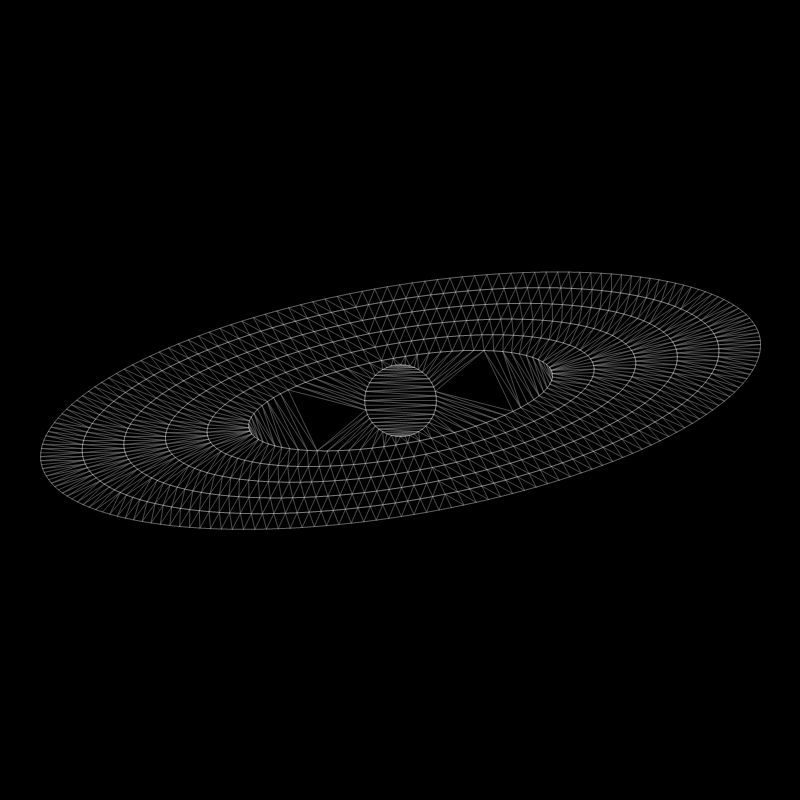
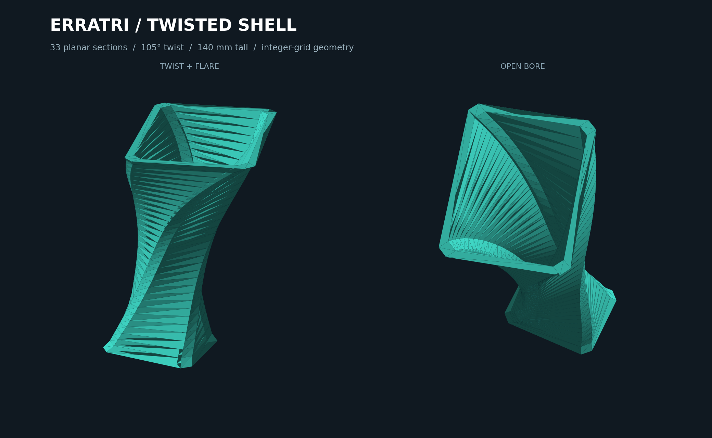

# Erratri

Erratri is a small geometry project that builds 3D shapes on the integer grid (Z^3) and exports binary STL. The demo renders a simple solar system with a sun, eight planets, their moons, and thin tilted orbit rings.

## Pure Z^3, Mesh-First

- All vertices live on the integer lattice Z^3 (no persistent floats).
- Shapes expose closed-surface meshes; many are built internally via tetra decompositions.
- Construction uses double math only transiently (e.g., rotations), then rounds back to the grid.
- Integer-only topology; rounding returns to Z^3 after transient double math.
- Higher-level shapes (sphere, cylinder shell, etc.) may decompose to tetrahedra internally.


## Demo Code

The demo uses a tiny data helper (`Demo/Planets.cs`) so `Program.cs` reads like a short scene description. Here is the essence of the program:

```csharp
using World;
using Geometry;
using Demo; // Planets helper (data only)

var world = new World();
var sunCenter = new Point(0, 0, 0);
world.Add(new Sphere(radius: 180, center: sunCenter));

void AddPlanet(in Planets.Planet p, double phaseDeg)
{
    // Thin tilted orbit ring
    world.Add(new Cylinder(radius: p.OrbitRadius, thickness: 2, height: 2,
                                   center: sunCenter, segments: null,
                                   xTiltDeg: p.InclinationDeg, yTiltDeg: 0, zSpinDeg: p.AscendingNodeDeg));

    // Place the planet on its tilted plane (details in Program.cs)
    // ... compute position and add spheres for planet and moons ...
}

// Mercury, Venus, Earth(+moon), Mars(+2), Jupiter(+4), Saturn(+3), Uranus(+2), Neptune(+1)
AddPlanet(Planets.Mercury, phaseDeg: 10);
AddPlanet(Planets.Venus, phaseDeg: 60);
AddPlanet(Planets.Earth, phaseDeg: 130);
AddPlanet(Planets.Mars, phaseDeg: 210);
AddPlanet(Planets.Jupiter, phaseDeg: 280);
AddPlanet(Planets.Saturn, phaseDeg: 330);
AddPlanet(Planets.Uranus, phaseDeg: 45);
AddPlanet(Planets.Neptune, phaseDeg: 95);

world.Save("clean_system.stl");
```

See the full, runnable code in:
- `Demo/Program.cs`
- `Demo/Planets.cs`

## Boolean Kernel Layers (Work in Progress)

The boolean mesher lives in `Kernel` and is deliberately layered:

- **Intersection graph + topology**: `IntersectionSet`, `IntersectionGraph`, `Intersection.Index.IntersectionIndex`, and `MeshA` / `MeshB` capture where two closed meshes intersect and how triangles are connected.
- **Per-triangle PSLG subdivision**: `TriangleSubdivision` and `PslgBuilder` build a local planar straight-line graph in barycentric UV space for each intersected triangle, then triangulate interior faces back to 3D.
- **Patch classification and selection**: `TrianglePatches`, `Classification`, and `PatchSelector` group subdivided triangles into patches, classify them as inside/outside the other solid, and pick which patches to keep for each boolean operation.
- **Assembly and validation**: `BooleanMeshAssembler` merges vertices, assembles triangles into a `BooleanMesh`, and runs strict manifold and degeneracy checks. `BooleanOps` is a small façade that ties these layers together for `ClosedSurface` inputs.

The boolean gallery in `Demo.Boolean.Mesh/Program.cs` showcases four basic CSG operations on two spheres:

```csharp
using World;
using Geometry;

long r = 200;
var aCenter = new Point(0, 0, 0);
var bCenter = new Point(150, 0, 0);

var a = new Sphere(r, subdivisions: 3, center: aCenter);
var b = new Sphere(r, subdivisions: 3, center: bCenter);

var spacing = 500;
var union        = new Union(a, b).Translate(0,          0, 0);
var intersection = new Intersection(a, b).Translate(spacing,     0, 0);
var diffAB       = new DifferenceAB(a, b).Translate(2 * spacing, 0, 0);
var diffBA       = new DifferenceBA(a, b).Translate(3 * spacing / 2, 0, 0);

var world = new World.World();
world.Add(union);
world.Add(intersection);
world.Add(diffAB);
world.Add(diffBA);

world.Save("spheres_boolean_showcase.stl");
```

This produces the boolean gallery rendered in `boolean_mesh.png`.



The Cheese regression exercises all three tunnel cuts and all eight sphere cuts, checking closure, directed edge consistency, decreasing positive volume, and exact coplanar Delaunay legality after every integer-grid conversion. Run it with `dotnet test Tests.Boolean.Operation --filter FullCheese`. The executable demo is `dotnet run --project Demo.Boolean.Mesh.Cheese -c Release`.

## ConstrainedTriangulator — 2D constrained triangulation library

ConstrainedTriangulator is a super simple 2D constrained triangulation library for planar straight-line graphs (PSLG). The input is a set of points together with optional constrained segments, and the output is a set of triangles that forms a complete triangulation of the domain while respecting all constraints.

`IntegerConformingDelaunay.Run(points, segments, maxSteinerPoints: 4096)` accepts coplanar `Geometry.Point` vertices in Z³ and returns integer points, triangles, and recovered constraint subsegments. Input indices are preserved. Orientation, coplanarity, and physical in-circle decisions use `BigInteger`; no floating projection or rounding participates in this API. Missing constraints are split only at interior lattice points, chosen using the greatest common divisor of their coordinate differences. Cocircular diagonals are recovered without unnecessary refinement. Returned triangles satisfy the Delaunay criterion on the **returned integer vertices**.

Integer refinement is not always possible. For example, the segment `(0,0)–(2,1)` has no interior lattice point and cannot be a Delaunay edge in the presence of `(1,0)` and `(1,1)`. This API throws on unrecoverable segments, invalid/nonplanar input, unsplit crossing constraints, or budget exhaustion; it never substitutes fractional vertices or returns a partial mesh. It triangulates the convex hull and does not promise minimum angles or optimal Steiner placement.

The boolean pipeline still uses transient physical-plane construction (`ConformingDelaunay.Run`) for intersection patches. Its floating Steiner vertices are construction data. At `BooleanMeshConverter.ToMesh`, coordinates are rounded once, then seam incidence and coplanar edge legalization use exact integer predicates. `IntegerMeshDelaunay.ConformAndLegalize` neither adds nor moves vertices; boundaries, noncoplanar creases, and edges whose alternate diagonal already exists are protected. The final integer surface is checked for remaining flippable, locally non-Delaunay coplanar edges. This preserves the existing surface topology; it is a constrained surface guarantee, **not a claim of globally conforming Delaunay across creases**, and no minimum-angle guarantee is made. The standalone integer conforming API above has the stronger planar contract and explicit failure behavior.

`Triangulator.Run` and `RunFast` remain available as the legacy edge-completion algorithms. Their combinatorial validator does not certify the Delaunay property.

Mesh winding follows outward source normals, difference operations reverse cutter faces, and coplanar selection is local to a face. The intersection graph assigns vertex identity once and shares the pair-to-global mapping with indexing/topology. World-space welding uses `MergeEpsilon` (1e-9 grid units), independently of predicate tolerances.



## Building and Running

### Lofted solids and hollow shells

`Loft` connects corresponding vertices of two or more `LoftSection` objects.
A section has an outer polygon and optionally one inner polygon; an inner
polygon creates an open bore with solid rims joining the walls at both ends.
Without an inner polygon, both ends are capped. The result is a regular `Shape`
that can be transformed, added to a `World`, or used in boolean operations.

```csharp
var shell = new Loft(new[]
{
    new LoftSection(bottomOuter, bottomInner),
    new LoftSection(middleOuter, middleInner),
    new LoftSection(topOuter, topInner)
});
world.Add(shell);
```

This first version requires strictly convex, exactly planar integer polygons,
matching vertex counts, consistent winding and corresponding indices. Inner
rings must be strictly inside the outer ring, in the same plane and winding.
Each section must have the same hole presence. Use intermediate sections to
control bends and twists; side quads are triangulated and need not be planar.
Construction checks exact planarity, degeneracy, closed oriented edges and
nonzero signed volume. It does not detect global self-intersections; callers
must provide a non-self-intersecting section sequence. Inner-ring scaling does
not imply constant wall thickness, especially through twists and bends.

Run `dotnet run --project Demo.Loft.Shell -c Release` for a hollow, bending,
flared octagonal shell: 33 sections, 105-degree twist, 140 mm height. It writes
`twisted_shell.stl` in millimetre coordinates. To render the actual mesh, run
`python Demo.Loft.Shell/render_preview.py` (requires NumPy and Matplotlib).



Shapes support in-place, chainable transforms. `Translate(dx, dy, dz)` adds an
offset to the current mesh; `Rotate(xDegrees, yDegrees, zDegrees)` rotates around
the world origin in X, Y, Z order, then rounds to the integer grid. Both return
the same shape, so call order matters. `Position` remains a compatibility alias
for `Translate`. Constructor properties such as `Center` describe the original
construction and are not updated by mesh transforms.

```csharp
var world = new World.World();
world.Add(new Box(100, 200, 300)
    .Rotate(zDegrees: 90)
    .Translate(400, 0, 0));
world.Save("scene.stl");
```

### Pipe junction demo

Run `dotnet run --project Demo.Boolean.Mesh.PipeJunction -c Release` to union
two hollow cylinders crossing at 60 degrees. The demo checks that both inputs
and the final integer-grid mesh have positive signed volume and that every edge
is shared by two oppositely directed faces, then writes `pipe_junction.stl` in
the working directory. This unions the pipe material; it does not drill out
any walls remaining inside the overlapping bores.

### Curved MX keyboard column

Run `dotnet run --project Demo.Keyboard.Column -c Release` to build three MX
switch mounts using `DifferenceAB`, transforms, `Union`, and `World`.
Each mount is 20 x 20 mm with a nominal 14 x 14 mm square opening and a 1.5 mm
plate. Key centres use 19.05 mm pitch along Y, with 12-degree tilt steps and
centres on a circular arc. These layout dimensions are demo choices.
The nominal switch opening and plate thickness follow the
[Cherry MX mechanical drawing](https://www.smcelectronics.com/DOWNLOADS/CHERRYMX.PDF).

Modeling uses 100 integer grid units per millimetre. The demo exports
`mx_curved_column.stl` via `world.Save(path, coordinateScale: 0.01)`, so STL
coordinates are millimetres. Default `Save(path)` still uses unscaled coordinates.
The final mesh is checked for opposite edge directions, positive volume,
connectivity, and Euler characteristic corresponding to three through-holes.
This is a switch-plate prototype, without a case or keycap-clearance validation.

Known kernel limitation: cutting the openings after joining blank plates fails
manifold validation. Joining finished mounts sequentially in row order -1,0,1
also fails in `MeshConformer`. The demo joins the disjoint outer mounts first,
then the centre mount; that construction passes the checks above.

- Build: `dotnet build Erratri.sln -c Release`
- Run demo: `dotnet run --project Demo -c Release`
- Output: `Demo/bin/Release/net9.0/clean_system.stl`
